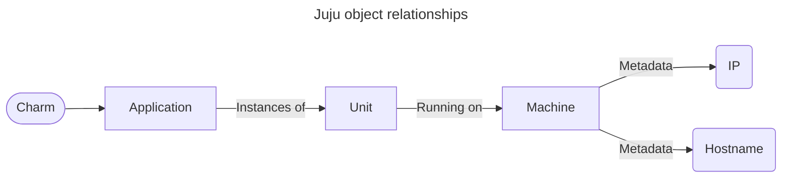

<div align="center">

# Juju Jockey

*Juju objects at your fingertips 🫰*


[![License][shield-license]][url-license]
[![Stars][shield-stars]][url-stars]
[![Forks][shield-forks]][url-forks]
[![Issues][shield-issues]][url-issues]
[![Pull Requests][shield-prs]][url-prs]
[![Tests][shield-tests]][url-tests]
[![Contributors][shield-contributors]][url-contributors]
[![Python Version][shield-python]](pyproject.toml)
[![Style][shield-style]][url-style]

[shield-license]: https://img.shields.io/github/license/LCVcode/jockey?style=for-the-badge
[shield-tests]: https://img.shields.io/github/actions/workflow/status/LCVcode/jockey/ci.yml?style=for-the-badge&label=tests
[shield-python]: https://img.shields.io/python/required-version-toml?tomlFilePath=https%3A%2F%2Fraw.githubusercontent.com%2FLCVcode%2Fjockey%2Fmaster%2Fpyproject.toml&style=for-the-badge
[shield-style]: https://img.shields.io/badge/Style-Black-black?style=for-the-badge

[shield-issues]: https://img.shields.io/github/issues/LCVcode/jockey?style=for-the-badge
[shield-prs]: https://img.shields.io/github/issues-pr/LCVcode/jockey?style=for-the-badge&label=PRs
[shield-stars]: https://img.shields.io/github/stars/LCVcode/jockey?style=for-the-badge
[shield-forks]: https://img.shields.io/github/forks/LCVcode/jockey?style=for-the-badge
[shield-contributors]: https://img.shields.io/github/contributors/LCVcode/jockey?style=for-the-badge

[url-license]: LICENSE
[url-style]: https://github.com/psf/black
[url-tests]: https://github.com/LCVcode/jockey/actions/workflows/ci.yml
[url-issues]: https://github.com/LCVcode/jockey/issues
[url-prs]: https://github.com/LCVcode/jockey/pulls
[url-stars]: https://github.com/LCVcode/jockey/stargazers
[url-forks]: https://github.com/LCVcode/jockey/forks
[url-contributors]: https://github.com/LCVcode/jockey/graphs/contributors

</div>

## Overview

Jockey is a CLI tool designed to facilitate quick and easy retrieval of Juju objects using filters.  It uses automatic caching of Juju's status in json format to enable faster parsing.

Jockey relies on this model of Juju objects and how they are related:


All filtering actions are performed by navigating this tree.

## Command Anatomy

The anatomy of a Jockey command is as follows:
```
jockey <object> <filters> <options>
```

`<object>` refers to any of the searchable Juju objects, such as applications and units.  `<filters>` is a space delimited list of filters (see below).

### Filters

Filters follow a specific syntax and allow the user to limit Jockey's output to meet certain criteria.  All filters have this structure:
```
<object><filter-code><content>
```
Just like in the origial `jockey` command anatomy, `<object>` is any of the searchable Juju objects.

## Examples:

<!-- jockey units -->
<details>
<summary><code>jockey units</code></summary>
<pre>
ceph-osd/0 telegraf-ceph/2 ceph-osd/1 telegraf-ceph/1 ceph-osd/2 telegraf-ceph/0 mysql-innodb-cluster/0 telegraf-mysql/0
</pre>
</details>

<!-- jockey units charm=ceph-osd -->
<details>
<summary><code>jockey units charm=ceph-osd</code></summary>
<pre>
ceph-osd/0 ceph-osd/1 ceph-osd/2
</pre>
</details>

<!-- jockey charms machine=1 -->
<details>
<summary><code>jockey charms machine=1</code></summary>

> **Note**
> Sorry, the `machine` filter is not yet implemented; stay tuned!

</details>

<!-- jockey app charm=charm-nrpe machine=4/lxd/2 -->
<details>
<summary><code>jockey app charm=charm-nrpe machine=4/lxd/2</code></summary>

> **Note**
> Sorry, the `app` filter is not yet implemented; stay tuned!

</details>

<!-- jockey units app^=nova principal=true hostname~blrt -->
<details>
<summary><code>jockey units app^=nova principal=true hostname~blrt</code></summary>

> **Note**
> Sorry, the `app` filter is not yet implemented; stay tuned!

</details>

## Wishlist:

* Allow comma-delimited selection of multiple object types:
    `jockey get unit,app`
* Filter by leadership
* Filter by principal
* Filter by lxd
